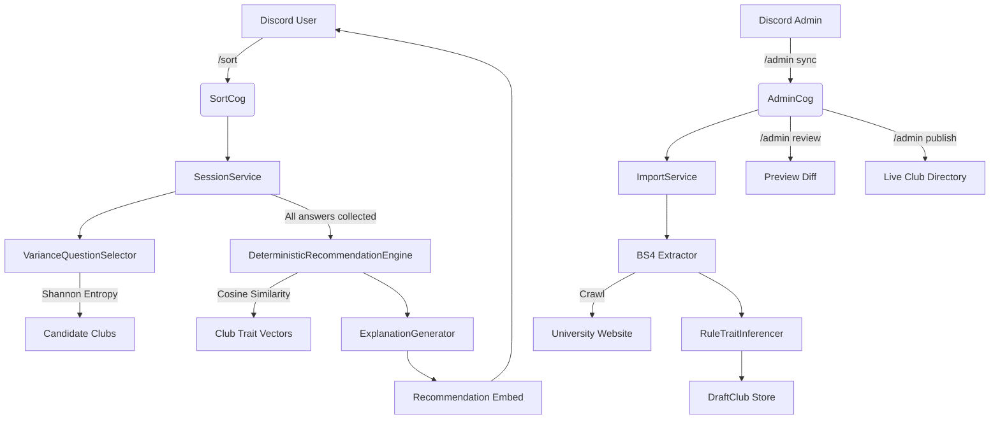

# sorts.me (Sortling) 🧭 

### 🎓 Find your clubs. Adaptive campus guide for university Discord servers.

[](https://python.org)
[](https://github.com/nextcord/nextcord)
[](https://sqlalchemy.org)
[](https://render.com)

> **Students join campus clubs without knowing what exists. sorts.me fixes that by asking a short set of adaptive questions and matching each student to the clubs that actually fit them.**

**sorts.me** is a multi-tenant Discord bot that brings an Akinator-style adaptive questionnaire to any university server. Instead of reading through a long directory and guessing, students answer a handful of questions and receive three ranked, personalized club recommendations with a plain-language explanation for each match.

Sortling is the mascot that guides students through the experience. The platform is sorts.me.

---

## 🌟 Key Features

* 🎯 **Adaptive Matching:** A Bayesian engine selects each question using Shannon Entropy to maximize information gain, narrowing the candidate pool with every answer.
* 🏆 **Ranked Recommendations:** Students receive their top three clubs ranked by a weighted score that prioritizes interest alignment (85%) over workload commitment (15%).
* 🏫 **Multi-Tenant:** Any university can install the bot, run `/setup`, and get an isolated club directory. Existing universities are unaffected.
* 🔄 **Live Club Sync:** Administrators run `/admin sync` to crawl the university clubs page, then `/admin review` to preview changes before they go live.
* 📊 **Session Analytics:** Every completed session is logged with the full answer trace, trait vector, and match scores for ongoing improvement.
* 💬 **Feedback Loop:** Students rate their matches with `/feedback`. Ratings are stored against the specific recommendation for future tuning.
* 🚀 **Render Ready:** Ships with `render.yaml` and a persistent SQLite disk mount for one-click cloud deployment.

---

## 🏗️ Architecture



---

## 📂 Codebase Structure

* **`DeterministicRecommendationEngine` ([deterministic_engine.py](sorts/core/recommendation/deterministic_engine.py)):** Scores every club against the student's trait vector using cosine similarity. Separates interest and commitment scoring to prevent workload from dominating matches.
* **`VarianceQuestionSelector` ([variance_selector.py](sorts/core/questions/variance_selector.py)):** Chooses the next question by simulating all option outcomes and selecting the question that minimizes expected Shannon Entropy across candidate clubs.
* **`ExplanationGenerator` ([explanation_generator.py](sorts/core/recommendation/explanation_generator.py)):** Generates a concise, deterministic explanation for each match derived directly from the matched trait names - no AI wording.
* **`RuleTraitInferencer` ([rule_trait_inferencer.py](sorts/core/traits/rule_trait_inferencer.py)):** Infers club trait weights from crawled descriptions using regex keyword matching. Fully dynamic - adding a new trait requires no code changes to the engine.
* **`ImporterPipeline` ([pipeline.py](sorts/core/importer/pipeline.py)):** Orchestrates crawling, trait inference, and draft storage. Stages changes for admin review before publishing.
* **`SessionService` ([session_service.py](sorts/services/session_service.py)):** Manages the full student session lifecycle from creation through recommendation generation. Logs every session for analytics.
* **`AdminCog` ([admin.py](sorts/bot/cogs/admin.py)):** Exposes `/setup`, `/admin sync`, `/admin review`, and `/admin publish` for server administrators.

---

## 🛠️ Installation and Setup

1. Clone the repository and create a virtual environment:
   ```bash
   git clone https://github.com/keepsloading/sorts.me.git
   cd sorts.me
   python -m venv .venv
   .venv\Scripts\activate   # Windows
   pip install -r requirements.txt
   ```

2. Copy the environment template and fill in your Discord bot token:
   ```bash
   cp .env.template .env
   ```

   ```env
   DISCORD_TOKEN=your_token_here
   DATABASE_URL=sqlite:///sorts.db
   ```

3. Seed the database and import club data:
   ```bash
   python -m sorts.cli seed
   python -m sorts.cli import --source-id 2
   python -m sorts.cli publish --job-id 1
   ```

4. Launch the bot:
   ```bash
   # Windows - double-click run.bat, or:
   python main.py
   ```

---

### ☁️ Cloud Deployment (Render)

sorts.me ships with a `render.yaml` blueprint. Connect the repository to Render, set `DISCORD_TOKEN` in the environment dashboard, and deploy. The bot runs as a background worker with a 1 GB persistent disk mounted at `/var/data/sorts.db`.

---

## 📝 Environment Variables

```env
DISCORD_TOKEN=          # Required. Your Discord bot token.
DATABASE_URL=           # Optional. Defaults to sqlite:///sorts.db
LOG_LEVEL=              # Optional. Defaults to INFO
EXEMPTED_GUILDS=        # Optional. Comma-separated guild IDs that auto-resolve to Mahindra University.
```

---

## 💡 Naming

> [!NOTE]
> **sorts.me** is the platform and brand. **Sortling** is the mascot that guides students through the questionnaire. The two names are not interchangeable.
