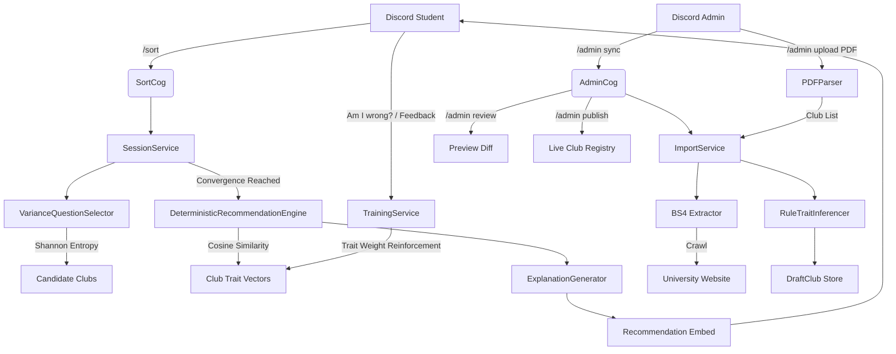

# sorts.me (Sortling) 

### Find your clubs. Campus club matching for university Discord servers.

[](https://python.org)
[](https://github.com/nextcord/nextcord)
[](https://sqlalchemy.org)
[](https://render.com)

> **Students join campus clubs without knowing what exists. sorts.me fixes that by asking a short set of targeted questions and matching each student to the clubs that actually fit them.**

**sorts.me** is a multi-tenant Discord bot that brings a decision-tree questionnaire to university servers. Instead of reading through long static directories, students answer a short set of questions and receive three ranked, personalized club recommendations with plain-language explanations.

**Sortling** is the mascot that guides students through the questionnaire experience. The platform is **sorts.me**.

---

## Key Features

* **Club Matching Questionnaire:** A Bayesian matching engine selects questions using Shannon Entropy to maximize information gain, reaching convergence in 3 to 6 questions.
* **Ranked Recommendations:** Students receive their top three club matches scored by a vector similarity model prioritizing interest alignment (85%) over workload commitment (15%).
* **Verified Club Registry:** Evidence-backed club database with verification confidence ratings, multi-attribute aliases, categories, and direct contact details.
* **Multi-Stage Search:** Find any club via slash option autocomplete (`/club`) with fuzzy matching across names, aliases, tags, and category keywords.
* **Self-Training Engine:** Real-time feedback loop that dynamically adjusts club trait weights when students refine their interests or submit feedback.
* **Multi-Tenant Architecture:** Any university can add the bot, run `/setup`, and operate an isolated club directory. New universities start with an empty registry and populate it via web crawling, PDF upload, or manual entry.
* **Crawler Pipeline:** Administrators run `/admin sync` to crawl university club pages, `/admin review` to preview diffs, and `/admin publish` to update live listings.
* **PDF Upload and Overwrite:** Administrators run `/admin upload` with a PDF attachment to import a full club list directly, overwriting existing entries matched by name.
* **Feedback and Logging:** Built-in stdout feedback stream (`[FEEDBACK_LOG]` and `[SELF_TRAINING]`) to monitor student interactions and recommendation quality.
* **Cloud Ready:** Ships with a `render.yaml` blueprint for zero-config cloud hosting.

---

## Slash Commands

| Command | Access | Description |
|---|---|---|
| `/sort` | All students | Starts the club matching questionnaire. |
| `/club <name>` | All students | Looks up a specific club profile card with verification info and contacts. Supports autocomplete. |
| `/clubs` | All students | Opens an interactive paginated directory of all registered clubs. |
| `/events` | All students | Lists upcoming campus hackathons, workshops, and opportunities. |
| `/feedback <rating>` | All students | Submits match quality feedback to improve recommendations. |
| `/about` | All students | Displays Sortling mascot info, bot status, and platform version. |
| `/setup` | Administrators | Links the Discord server to a university profile and auto-crawls the club directory. |
| `/admin sync` | Administrators | Crawls the configured source URL and stages changes for review. |
| `/admin review` | Administrators | Previews pending club changes before they go live. |
| `/admin publish` | Administrators | Immediately publishes the latest synced club data. |
| `/admin upload` | Administrators | Uploads a PDF club list and overwrites the directory immediately. |
| `/admin add_club` | Administrators | Manually adds a single club to the directory. |

---

## Architecture



---

## Codebase Structure

* **`DeterministicRecommendationEngine` ([deterministic_engine.py](sorts/core/recommendation/deterministic_engine.py)):** Scores candidate clubs against student trait vectors using cosine similarity.
* **`VarianceQuestionSelector` ([variance_selector.py](sorts/core/questions/variance_selector.py)):** Dynamically selects the next question by calculating expected Shannon Entropy reduction across candidate clubs.
* **`TrainingService` ([training_service.py](sorts/services/training_service.py)):** Online self-training engine that adjusts club trait weights based on student interest feedback.
* **`ClubService` ([club_service.py](sorts/services/club_service.py)):** Multi-stage search engine matching queries against club names, aliases, category, and tags.
* **`RuleTraitInferencer` ([rule_trait_inferencer.py](sorts/core/traits/rule_trait_inferencer.py)):** Infers trait weights from text descriptions using regex keyword rule sets.
* **`ImporterPipeline` ([pipeline.py](sorts/core/importer/pipeline.py)):** Manages crawling, trait inference, draft staging, and publishing. Also accepts explicit club lists via `run_import_from_list` (used by PDF upload).
* **`PDFParser` ([pdf_parser.py](sorts/core/importer/pdf_parser.py)):** Heuristic text extractor that parses club names and descriptions from uploaded PDF files.
* **`ImportService` ([import_service.py](sorts/services/import_service.py)):** Service layer over the pipeline. Exposes `trigger_import`, `import_from_clubs_list`, `publish_job`, and related helpers.
* **`SessionService` ([session_service.py](sorts/services/session_service.py)):** Manages student sessions, decision tree state, and recommendation logging.
* **`SeedService` ([seed_service.py](sorts/services/seed_service.py)):** Handles database seeding, verified club registry synchronization, and event seeding for the default university.

---

## Installation and Setup

1. Clone the repository:
   ```bash
   git clone https://github.com/keepsloading/sorts.me.git
   cd sorts.me
   pip install -r requirements.txt
   ```

2. Configure environment variables (`.env`):
   ```bash
   cp .env.template .env
   ```

   ```env
   DISCORD_TOKEN=your_bot_token_here
   DATABASE_URL=sqlite:///sorts.db
   DEFAULT_UNIVERSITY_SLUG=mahindra
   ```

3. Start the bot:
   ```bash
   python main.py
   ```
   Database schema migrations, question/trait seeding, and the initial club import run automatically on boot.

4. Run unit tests:
   ```bash
   python -m pytest
   ```

---

## Cloud Deployment (Render)

**sorts.me** is preconfigured with a `render.yaml` blueprint:
1. Connect the repository to the Render dashboard.
2. Select **Docker Web Service** runtime.
3. Add `DISCORD_TOKEN` and `DATABASE_URL` in the environment dashboard.
4. Deploy. Database seeding and migrations run automatically on startup.

---

## Environment Variables

```env
DISCORD_TOKEN=               # Required. Discord Bot Token from Developer Portal.
DATABASE_URL=                # Optional. Defaults to sqlite:///sorts.db
LOG_LEVEL=                   # Optional. Defaults to INFO
EXEMPTED_GUILDS=             # Optional. Comma-separated guild IDs routed to the default university.
DEFAULT_UNIVERSITY_SLUG=     # Optional. Slug of the default university. Defaults to "mahindra".
```

---

## Design and UI Principles

The following rules apply across all bot output. They are documented in [AGENTS.md](.agents/AGENTS.md).

* No emojis in button labels or embed text.
* No em dashes anywhere. Use a plain hyphen or restructure the sentence.
* `thinking.gif` is only used as a thumbnail during loading and progress steps. It is never attached to final result or confirmation embeds.
* Embed thumbnails use `set_thumbnail(url=...)` only - never as a standalone file attachment.
* Mahindra University seed data must never be used as a fallback for any other guild. New university servers start with empty registries.

---

> [!NOTE]
> **sorts.me** is the platform and project name. **Sortling** is the mascot that guides students through the questionnaire. The two names are distinct and complementary.
