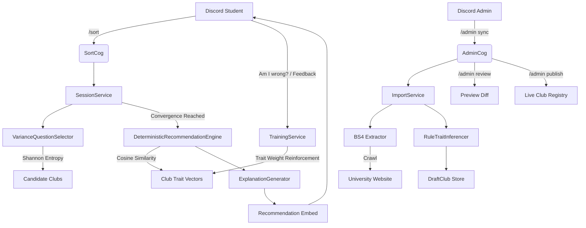

# sorts.me 🧭 

### 🎓 Find your clubs. Adaptive campus guide for university Discord servers.

[](https://python.org)
[](https://github.com/nextcord/nextcord)
[](https://sqlalchemy.org)
[](https://render.com)

> **Students join campus clubs without knowing what exists. sorts.me fixes that by asking a short set of adaptive questions and matching each student to the clubs that actually fit them.**

**sorts.me** is a multi-tenant Discord bot that brings an adaptive decision-tree questionnaire to university servers. Instead of reading through long static directories, students answer a dynamic set of targeted questions and receive three ranked, personalized club recommendations with plain-language explanations.

**Sortling** is the mascot that guides students through the questionnaire experience. The platform is **sorts.me**.

---

## 🌟 Key Features

* 🎯 **Adaptive Decision Tree:** A Bayesian matching engine selects questions using Shannon Entropy to maximize information gain, reaching convergence in 3 to 6 questions.
* 🏆 **Ranked Recommendations:** Students receive their top three club matches scored by a vector similarity model prioritizing interest alignment (85%) over workload commitment (15%).
* 🛡️ **Verified Club Registry:** Evidence-backed database of **50 university clubs** complete with verification confidence ratings, multi-attribute aliases, categories, and direct contact details.
* 🔍 **Multi-Stage Alias Search:** Find any club via slash option autocomplete (`/club`) with fuzzy matching across names, exact aliases, tags, and category keywords.
* 🧠 **Automated Self-Training Engine:** Real-time feedback loop that dynamically adjusts club trait weights when students refine their interests or submit feedback.
* 🏫 **Multi-Tenant Architecture:** Any university can add the bot, run `/setup`, and operate an isolated club directory with automatic database schema migrations.
* 🔄 **Live Crawler Pipeline:** Administrators run `/admin sync` to crawl university club pages, `/admin review` to preview diffs, and `/admin publish` to update live listings.
* 💬 **Feedback & Logging:** Built-in stdout feedback stream (`[FEEDBACK_LOG]` & `[SELF_TRAINING]`) to monitor student interactions and recommendation quality.
* 🚀 **Cloud Ready:** Ships with a `render.yaml` blueprint and containerized deployment support for zero-config cloud hosting.

---

## 🤖 Slash Commands

| Command | Usage | Access | Description |
|---|---|---|---|
| `/sort` | `/sort` | All Students | Starts the interactive adaptive club matching questionnaire. |
| `/club` | `/club <name>` | All Students | Looks up a specific club profile card with verification info & contacts (supports autocomplete). |
| `/clubs` | `/clubs` | All Students | Opens an interactive, paginated directory of all registered university clubs. |
| `/feedback` | `/feedback <rating> [comments]` | All Students | Submits match quality feedback to train the recommendation engine. |
| `/about` | `/about` | All Students | Displays Sortling mascot info, bot status, and platform version. |
| `/setup` | `/setup` | Administrators | Links the Discord server to a university context. |
| `/admin` | `/admin [sync \| review \| publish]` | Administrators | Manages live web crawler imports and directory updates. |

---

## 🏗️ Architecture



---

## 📂 Codebase Structure

* **`DeterministicRecommendationEngine` ([deterministic_engine.py](sorts/core/recommendation/deterministic_engine.py)):** Scores candidate clubs against student trait vectors using cosine similarity.
* **`VarianceQuestionSelector` ([variance_selector.py](sorts/core/questions/variance_selector.py)):** Dynamically selects the next question by calculating expected Shannon Entropy reduction across candidate clubs.
* **`TrainingService` ([training_service.py](sorts/services/training_service.py)):** Online self-training engine that adjusts club trait weights based on student interest feedback.
* **`ClubService` ([club_service.py](sorts/services/club_service.py)):** Multi-stage search engine matching queries against club names, aliases, category, and tags.
* **`RuleTraitInferencer` ([rule_trait_inferencer.py](sorts/core/traits/rule_trait_inferencer.py)):** Infers trait weights from crawled text descriptions using regex keyword rule sets.
* **`ImporterPipeline` ([pipeline.py](sorts/core/importer/pipeline.py)):** Manages crawling, trait inference, draft staging, and publishing.
* **`SessionService` ([session_service.py](sorts/services/session_service.py)):** Manages student sessions, adaptive decision tree state, and recommendation logging.
* **`SeedService` ([seed_service.py](sorts/services/seed_service.py)):** Handles automatic database seeding and verified club registry synchronization.

---

## 🛠️ Installation and Setup

1. Clone the repository and create a virtual environment:
   ```bash
   git clone https://github.com/keepsloading/sorts.me.git
   cd sorts.me
   python -m venv .venv
   .venv\Scripts\activate   # Windows (.venv/bin/activate on Linux/macOS)
   pip install -r requirements.txt
   ```

2. Configure environment variables (`.env`):
   ```bash
   cp .env.template .env
   ```

   ```env
   DISCORD_TOKEN=your_bot_token_here
   DATABASE_URL=sqlite:///sorts.db
   ```

3. Seed the database and synchronize the verified club registry:
   ```bash
   python main.py
   ```
   *(Auto-migrates SQLite schema, seeds questions/traits, and synchronizes 50 verified club profiles on boot).*

4. Run unit tests:
   ```bash
   python -m pytest
   ```

---

## ☁️ Cloud Deployment (Render)

**sorts.me** is preconfigured with a `render.yaml` blueprint:
1. Connect repository to Render dashboard.
2. Select **Docker Web Service** runtime.
3. Add `DISCORD_TOKEN` in environment dashboard.
4. Deploy — database seeding and migrations run automatically on startup.

---

## 📝 Environment Variables

```env
DISCORD_TOKEN=          # Required. Discord Bot Token from Developer Portal.
DATABASE_URL=           # Optional. Defaults to sqlite:///sorts.db
LOG_LEVEL=              # Optional. Defaults to INFO
EXEMPTED_GUILDS=        # Optional. Comma-separated guild IDs auto-linked to default university.
```

---

## 💡 Naming Convention

> [!NOTE]
> **sorts.me** is the platform and project name. **Sortling** is the mascot that guides students through the questionnaire. The two names are distinct and complementary.
